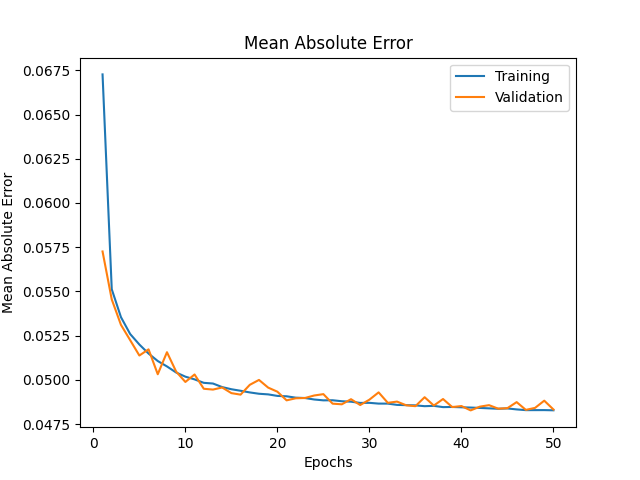
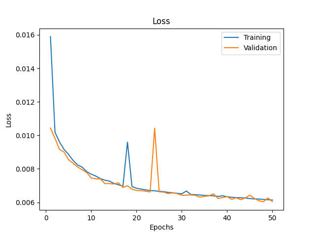
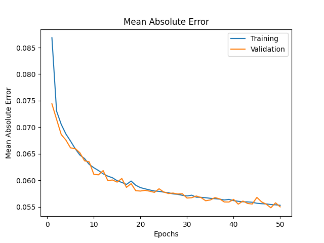

## ML models

## Neural models

baseline_model_50e_1024bsize_adam_lr0.001\

MAE: 0.04840100556612015\

Training Plots:
\

---

pca_baseline_model_50e_1024bsize_adam_lr0.001\

MAE: 0.055048465728759766\

Training Plots:
\

---

pca_baseline_model_reduced_50e_1024bsize_adam_lr0.001\

MAE: 0.05726763233542442\

Training Plots:
\
