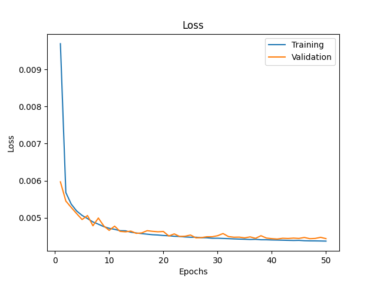

## ML models

## Neural models

baseline_model_50e_1024bsize_adam_lr0.001\\
saved at: ./saved_models/baseline_model_50e_1024bsize_adam_lr0.001.h5\\
MSE: 0.004458603914827108\\

Training Plots:
\\
\\

---

pca_baseline_model_50e_1024bsize_adam_lr0.001\\
saved at: ./saved_models/pca_baseline_model_50e_1024bsize_adam_lr0.001.h5\\
MSE: 0.006381600629538298\\

Training Plots:
\\
\\

---

pca_baseline_model_reduced_50e_1024bsize_adam_lr0.001\\
saved at: ./saved_models/pca_baseline_model_reduced_50e_1024bsize_adam_lr0.001.h5\\
MSE: 0.006431097164750099\\

Training Plots:
\\
\\